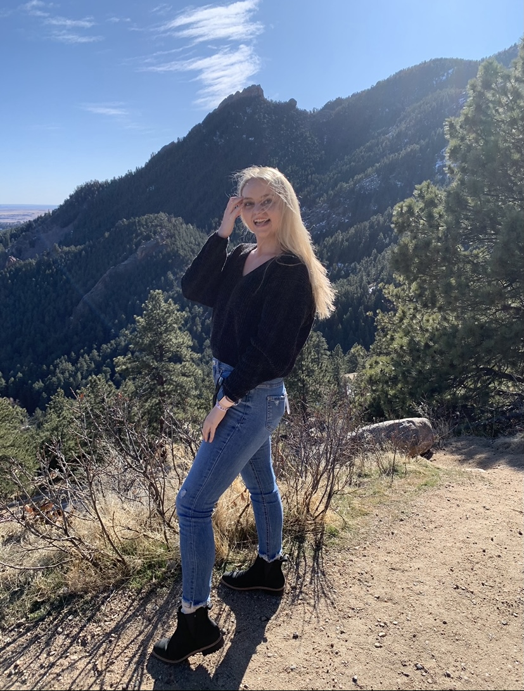

---

### <i class="fas fa-graduation-cap"></i> Where I've Been

I was born and raised in Chandler, Arizona, and it was not a hard decision to attend Arizona State University. I began classes immediately after high school, pursuing concurrent degrees in Business Data Analytics (BS) and Dance (BFA). 

After four years of school, I was able to graduate in May of 2020 Summa Cum Laude from Barrett, the Honors College with a:

- Bachelor of Science in Business Data Analytics
- Bachelor of Science in Sociology
- Minor in Dance
- Certificate in International Studies

My culminating capstone was my [Honors Thesis: Attitudes and Experiences with Period Poverty at Arizona State University](https://kirstenronning.github.io/portfolio/portfolio/), where I created a survey and used analyziation tools to provide a report to Arizona State University about the effects of period poverty on our students. Clearly one for multi-tasking, I have a passion for diversifying my skills and showing up in multiple capacities.

My Business Data Analytics program aimed to provide me with a wide range of analytical programs and tools, and I was exposed to SQL, Python, Tableau, SAS, R, and Orange. In my Statistics courses, we worked in SPSS. I also focused specifically on Microsoft Excel and HTML5 as elective courses.

I was hired as a Data Intern at the Arizona Commission of the Arts Spring of 2019. In this role, I conducted a semester-long internship working under the Programs and Grant Coordinator in order to learn how the non-profit arts sector functions by utilizing the SMU DataArts platform. I provided the Commission with a final report and presentation by combining data visualization and research into the Dance field in order to determine the span of the Commission in the state of Arizona.

One of my proudest achievements from Undergrad is receiving my 200-hour RYT Yoga Teacher certification. Through CorePower Yoga, I was able to guide students in order to create a welcoming space where students felt motivated to flourish in their community. I worked my way up to Studio Assistant Manager of our Old Town Scottsdale location, and I was granted the opportunity to lead two separate Yoga Teacher Trainings.

---

### <i class="fas fa-laptop"></i> What I'm Doing

I am currently a Graduate student at Arizona State University Online, and halfway through my Master of Science in Program Evaluation and Data Analytics. This program is truly the perfect combination of my two Bachelors of Science, as I am able to focus on fine-tuning my skills in data science and program analysis. The program explores primarily in R, where I have gained expertise in coding using various packages in order to create RMarkdown files and Dashboards. I am confident in my visualization and coding abilities in R and Tableau, and I have succinct statistical knowledge when it comes to designing and analyzing social programs.

I currently reside with my Golden Retriever [Tyson](https://kirstenronning.github.io/portfolio/tyson/) in Scottsdale, Arizona, but we will be relocating this Summer 2021. My favorite pastimes include yoga, hiking, kayaking, and traveling as much as possible!

---

### <i class="fas fa-briefcase"></i> What I Hope to Do

I am searching for a data science or program analyst position that allows me to build tools using visualization and machine learning to help people explore and understand their data. Please take a look at some of my work in my [Portfolio](https://kirstenronning.github.io/portfolio/portfolio/).

I would love to work in a position where I can provide data science tools and techniques to public policy research and implementation. I am grateful to be given an entry-level position and begin my data analyst career.

---

